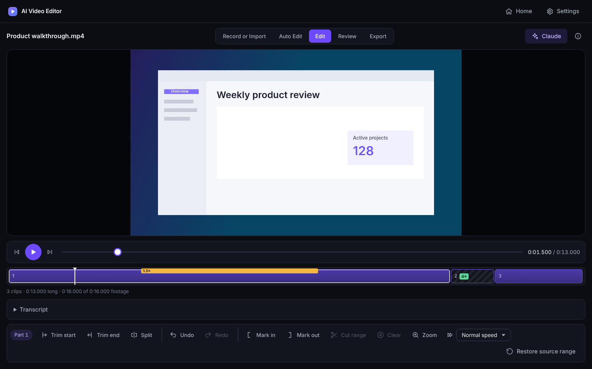
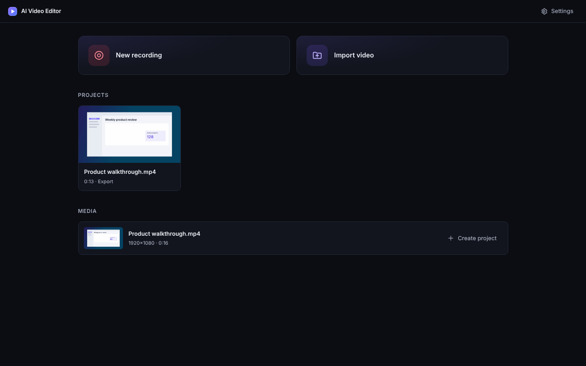
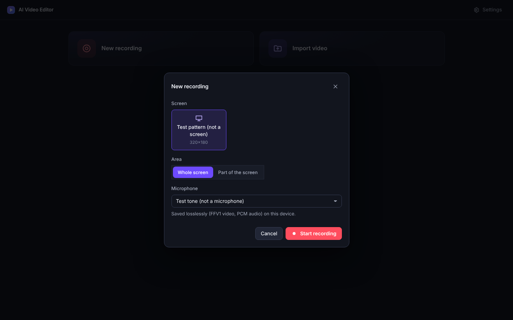
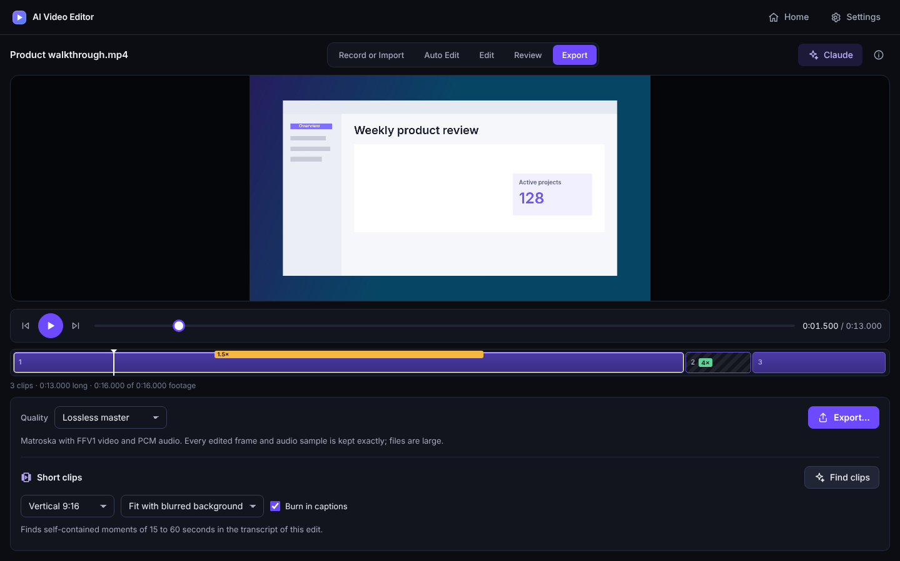

# AI Video Editor

Record your screen, let AI make the first cut, polish it with simple tools, and export a lossless master, all in one desktop app.



AI Video Editor is a standalone desktop recorder and editor for screen recordings, tutorials, demos and talking-head videos. Every edit, whether you make it or an AI assistant does, goes into the same non-destructive draft with full Undo. Your original footage is never changed.

> **Status:** early preview. The desktop app currently builds and runs on Linux with X11. Windows packaging and installers are in progress; macOS is not supported yet.

## Features

**Record**
- Record the whole screen or a dragged area, with or without a microphone.
- Countdown, pause and resume. Recordings are saved losslessly (FFV1 video, PCM audio).
- If the app quits during a take, recording stops with it and the take can be recovered on the next launch.

**Auto Edit**
- Local speech-to-text transcription (Whisper, runs on your device).
- **Magic Edit** makes a safe first cut: long pauses, filler words and repeated takes, at a gentle, balanced or tight setting.
- Captions from the transcript in three styles, with an .srt file or burned into the video.
- Audio cleanup: even out loudness and reduce background noise.

**Edit**
- Trim, split, cut a marked range, or restore removed footage.
- Zoom in on a detail by clicking the spot in the picture.
- Speed up typing, loading or waiting at 2×, 3×, 4× or 8×, keeping the voice's pitch.
- Correct transcript words and cut by selecting words.
- Keyboard shortcuts, plus Undo and Redo for every change.

**AI assistant**
- Ask an assistant to edit for you. It uses the same guarded tools as the manual controls, and every change can be undone.
- Connect with your **Claude** account through Claude Code (the default), with **Codex** and a ChatGPT account, or with an OpenAI, Gemini or DeepSeek API key.

**Export**
- A verified lossless master (Matroska, FFV1 + PCM) by default, or a smaller MP4 when you choose it.
- **Short clips:** find self-contained 15–60 second moments and export them as vertical, square or landscape videos with captions.

## How it works

Each project moves through five steps. Only the current step's tools are shown.

1. **Record or Import**: start a recording or bring in a video.
2. **Auto Edit**: transcribe, run Magic Edit, set captions and audio.
3. **Edit**: refine by hand or with the assistant.
4. **Review**: watch the edit and verify the draft.
5. **Export**: save the master or an MP4, or make short clips.

| Home | New recording | Export |
| --- | --- | --- |
|  |  |  |

## Getting started

You need [Node.js](https://nodejs.org/) 24, Python 3.9 or later, and [FFmpeg](https://ffmpeg.org/) with `ffprobe` on your `PATH`.

```bash
git clone https://github.com/klimPaskov/ai-video-editor.git
cd ai-video-editor
npm ci --ignore-scripts
npm run check          # type checks and the media test suite
```

The [getting started guide](docs/guide/getting-started.md) covers building the desktop app, first launch and connecting an AI assistant.

## Privacy

- Recordings, projects, transcripts and exports stay on your computer.
- Transcription runs locally. Its model (about 76 MiB) is downloaded once, after you confirm.
- Nothing is sent to an AI service until you ask the assistant something. The app then sends only the request and the project details the assistant reads, such as transcript excerpts and the edit timeline.
- Claude sign-in happens in Anthropic's own browser page through Claude Code. The app never sees or stores your Claude credentials.

See [Privacy and data](docs/guide/privacy.md) for details.

## Documentation

- [User guide](docs/guide/README.md): recording, editing, the AI assistant, export and short clips.
- [Documentation index](docs/README.md): architecture, specifications and design decisions.
- [Contributing](CONTRIBUTING.md): development setup, tests and pull requests.

## License

[MIT](LICENSE). Third-party components and their licences are listed in [THIRD_PARTY_NOTICES.md](THIRD_PARTY_NOTICES.md).
